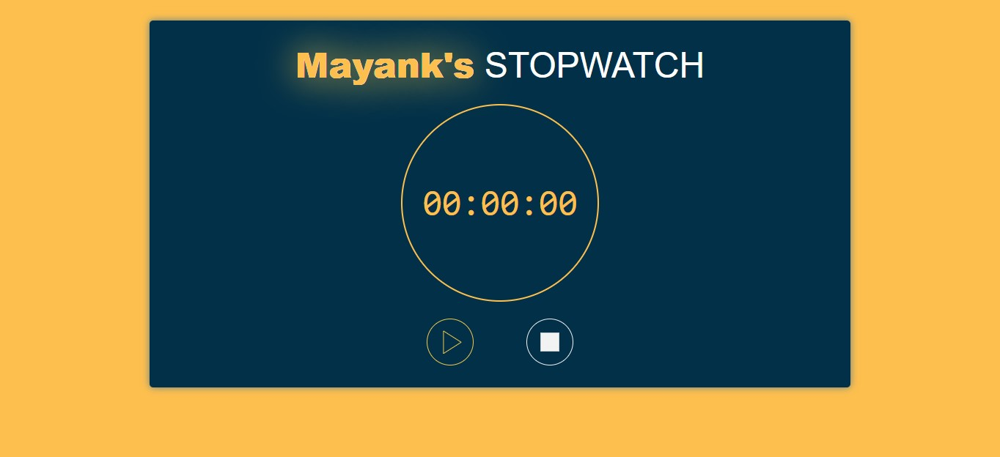

# Stopwatch

This repository contains a simple and elegant Stopwatch web app built using CSS and JavaScript. The app allows users to Play, Stop, and Reset, all while enjoying a beautiful user interface design.

## Features

- Add new time with a user-friendly interface.
- Start time to analyze.
- Delete completed time using Reset button.
- Start time.
- Pause time whenever wanted.

## Live Demo

You can check out the live demo of the Todo List web app [here](https://mayankmp.github.io/To-do-list/).

## Screenshots

## Technologies Used

- HTML: The structure of the web app.
- CSS with Tailwind CSS: For styling the app beautifully.
- JavaScript: To handle the interactive functionality of the app.
- Local Storage: To save todos for persistent data across browser sessions.

